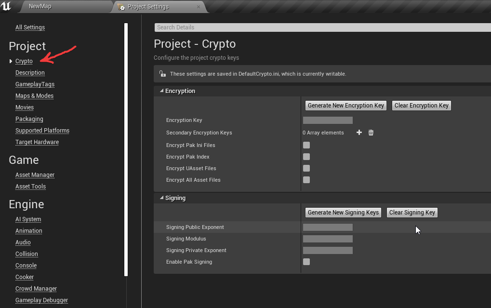

# **UE4 Speechace**


This is UE4 wrapper for [Speechace](https://www.speechace.com/) speech recognition service.

Plugin was used in production to create several english training VR games.

# Preparation

1) Contact with [Speechace](https://www.speechace.com/) guys and get the API key.
2) There are two ways how you can use it in project.
    * 2.1 By using environment variables. Create environment variable `SPEECHACE_API_KEY` with obtained key as value.

    * 2.2 By assigning key directly in blueprints.

    

    By default you need to set api key from nodes. To use environment variable, you need to set `SetUseApiKeyFromEnvironmentVars` to `true`.

> **ADVICE**: Pay attention to security and encrypt your assets before packaging.



# Text scoring
Consists of two parts. First, you need to record voice from microphone.
To do that, use provided SpeechaceMicrophoneCapture actor component as shown below.
Next, construct request parameters and pass them to **ScoreText** async node.
Unlike other speech recognition services, here you have to provide voice sample AND text what been pronounced.

// picture here

Once request completed, use **TextScore** structure to populate user interface.

# Text validation
You can also check if text you are going to process
is valid and can be scored on server side.

# Important steps

To make microphone work, you need to add following lines to `Engine.ini` of the project.
```
[Voice]
bEnabled=true
```

To not loose pauses in between words, you probably want to check silence detection treshold `voice.SilenceDetectionThreshold`, value `0.01` is good.
This also goes to `Engine.ini`.

```
[SystemSettings]
voice.SilenceDetectionThreshold=0.01
```

Or by executing console command during runtime


# Platforms supported

Used on **Windows**, **Mac** and **Linux** shouldn't be a problem also.

# Api docs

Find out more details in [documentation](https://docs.speechace.com/?version=latest).
